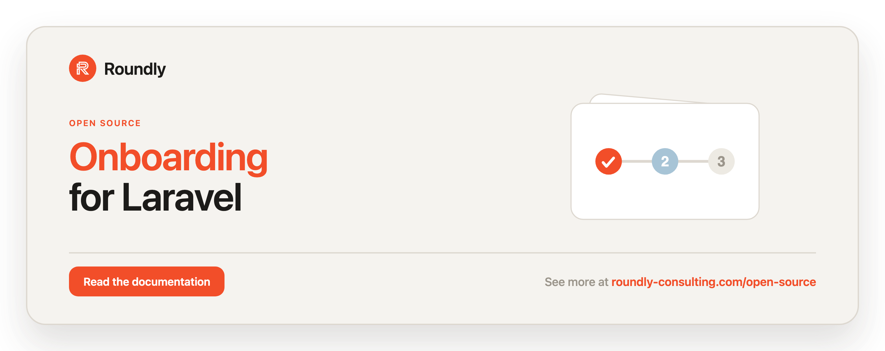

<!-- roundly-hero:start -->
<p align="center">
  <a href="https://roundly-consulting.com/open-source/docs/onboarding-for-laravel?utm_source=github&utm_medium=readme&utm_campaign=open-source&utm_content=onboarding-for-laravel">
    
  </a>
</p>
<!-- roundly-hero:end -->

# Onboarding for Laravel

Define and track multiple onboarding flows for your Laravel application.

This package lets you describe onboarding as a set of **flows**, each made of ordered
**steps**. Steps decide whether they are completed (or should be excluded) for a given model
through closures, so progress is derived on the fly from your existing data — there are no
extra tables to migrate and nothing to persist. Register the flows you need once, then ask a
model for its flow to get the next step, completion percentage, and a JSON-ready array for
your frontend.

## Requirements

- PHP `^8.4`
- Laravel `^12.0` or `^13.0`

## Installation

Install the package via Composer:

```bash
composer require roundly-consulting/onboarding-for-laravel
```

The service provider and the `Onboarding` facade alias are registered automatically through
package discovery. There is **no config file, no migrations, and no views** to publish — the
package is entirely in-memory and stateless, so `vendor:publish` has nothing to offer and a
bare `php artisan migrate` has nothing to run.

Check what is wired at a glance:

```bash
php artisan about --only=onboarding
```

It reports the *shape* of your onboarding — how many flows and steps are registered, whether a
default flow and a persistence store are bound — and never your flow keys, step copy, or
redirect targets.

## Core concepts

- **`Registry`** — the central store of named flows. Resolved as a singleton and reachable
  through the `Onboarding` facade.
- **`Flow`** — a named, ordered set of steps. Reports overall progress and the next step.
- **`Step`** — a single onboarding task. Its completion and exclusion are decided by optional
  closures (or by declarative helpers) that receive the subject the flow is bound to.
- **`GetsOnboarded`** — a trait for your Eloquent models that resolves the model's flow and
  binds the model to it.

A flow's **subject** is either an Eloquent `Model` or any `Illuminate\Contracts\Auth\Authenticatable`.
When you don't bind one explicitly, the flow falls back to `auth()->user()` at read time — see
[Binding the subject](#binding-the-subject).

## Usage

### Registering flows

Register flows once — typically in the `boot()` method of one of your application's service
providers.

```php
use App\Models\User;
use RoundlyConsulting\Onboarding\Facades\Onboarding;
use RoundlyConsulting\Onboarding\Flow;
use RoundlyConsulting\Onboarding\Step;

Onboarding::register(Flow::make('Profile Onboarding')->of([
    Step::make('Upload Photo')
        ->cta('Upload Now')
        ->action('users@photo@upload') // a route name, URL, or any hint your frontend understands
        ->completeIf(fn (?User $user) => (bool) $user?->photo),
]));
```

Registering a flow without a key stores it under the default key (`default`). You can also
register additional flows under explicit keys:

```php
Onboarding::register('admin', Flow::make('Admin Setup')->of([
    Step::make('Invite your team'),
    Step::make('Connect billing')->completeIf(fn (?User $user) => $user?->hasBilling()),
]));
```

You may register a flow straight from an array of steps — it is wrapped in a `Flow` for you,
and with no key it becomes the default flow:

```php
Onboarding::register([
    Step::make('Upload Photo')->cta('Upload Now'),
]);
```

### Fluent registration

`Onboarding::flow()` creates, registers, and returns an empty named flow you can build
inline:

```php
Onboarding::flow('default')
    ->title('Profile Onboarding')
    ->add('Upload Photo')->key('upload-photo')->cta('Upload Now')
        ->action('users@photo@upload')
        ->completeIf(fn (?User $user) => (bool) $user?->photo);
```

The registry also exposes `has()`, `forget()`, and `flush()`:

```php
Onboarding::has('admin');     // bool
Onboarding::forget('admin');  // remove one flow
Onboarding::flush();          // remove all flows
```

Registering a non-`Flow` class string throws
`RoundlyConsulting\Onboarding\Exceptions\InvalidFlowException` (which extends
`InvalidArgumentException`).

### Custom flow classes

For reusable flows, extend `Flow` and configure it in `setup()`:

```php
use RoundlyConsulting\Onboarding\Flow;
use RoundlyConsulting\Onboarding\Step;

final class UserOnboarding extends Flow
{
    protected function setup(): void
    {
        $this->title('User Onboarding')->of([
            Step::make('Say My Name'),
        ]);
    }
}
```

Register a custom flow class by its class string — the registry instantiates it:

```php
use RoundlyConsulting\Onboarding\Facades\Onboarding;

Onboarding::register(UserOnboarding::class);            // stored as the default flow
Onboarding::register('user', UserOnboarding::class);    // stored under the "user" key
```

### Preparing a model

Add the `GetsOnboarded` trait to any Eloquent model that should expose its onboarding flow:

```php
use Illuminate\Database\Eloquent\Model;
use RoundlyConsulting\Onboarding\Traits\GetsOnboarded;

class User extends Model
{
    use GetsOnboarded;
}
```

The trait resolves the model's flow from the registry and binds the model to it, so every
step's `completeIf` / `excludeIf` closure receives that model.

By default the model uses the `default` flow key. Override `defaultOnboardingKey()` to choose
a different one — for example, from a column on the model:

```php
public function defaultOnboardingKey(): string
{
    return $this->onboarding_flow ?? 'default';
}
```

### Reading a model's onboarding

```php
$user = User::first();

$flow = $user->onboarding();                 // the model's default flow, bound to $user
$flow = $user->onboarding('admin');          // a specific flow by key
$flow = $user->onboarding('missing', $fallback = new Flow()); // fallback when the key is unknown

$flow?->title;                 // "Profile Onboarding"
$flow?->isCompleted();         // bool — every required, non-excluded step is complete
$flow?->isInProgress();        // bool — at least one required step remains
$flow?->nextStep();            // the first incomplete Step, or null
$flow?->currentStep();         // alias of nextStep() — the step to resume on
$flow?->steps();               // Collection<int, Step> visible to this model (excluded steps removed)
$flow?->all();                 // Collection<int, Step> including excluded steps
$flow?->percentageCompleted(); // float across all visible steps, e.g. 66.67
$flow?->sections();            // Collection<int, SectionData> grouped by step group
$flow?->redirectToCurrentStep(); // ?RedirectResponse to the current step's target
$flow?->toArray();             // a JSON-ready array for your API/frontend
$flow?->toData();              // a typed RoundlyConsulting\Onboarding\DataTransferObjects\FlowData
```

`onboarding()` returns `null` when no matching flow is registered and no fallback is given.

### Binding the subject

A flow evaluates its steps against a **subject** — an Eloquent `Model` or any
`Illuminate\Contracts\Auth\Authenticatable`. Bind one explicitly with `for()`:

```php
Onboarding::find('default')?->for($user)->percentageCompleted();
```

When you don't, the flow uses the **authenticated user** (`auth()->user()`) automatically:

```php
// binds auth()->user() implicitly
Onboarding::find('default')?->percentageCompleted();

// an explicit subject always wins
Onboarding::find('default')?->for($otherUser)->percentageCompleted();
```

> **Behavioural note (since 1.1.0).** Reading a flow without calling `for()` now resolves to
> the logged-in user instead of a `null` subject. In a context with no auth (e.g. a plain unit
> test or a queue with no user) the subject stays `null`, exactly as before. Event listeners
> hinting `?Model $for` should be aware that a non-Model `Authenticatable` subject may now
> appear.

### Choosing the flow per subject (resolver)

Register a resolver once to map a subject to the flow key it should use, instead of branching
by hand. `resolveFor()` falls back to the default flow when the resolver returns `null` or an
unknown key:

```php
Onboarding::resolveUsing(fn ($subject) => $subject?->isAdmin() ? 'admin' : 'default');

Onboarding::resolveFor($user);   // the resolved Flow, bound to $user
$user->resolvedOnboarding();     // the same, from the GetsOnboarded trait
```

`flush()` clears the resolver along with the registered flows.

### Route enforcement middleware

Gate routes behind onboarding completion with the `onboarding` middleware. An authenticated
subject whose flow is unfinished is redirected to their current step; a complete (or absent)
flow passes through.

```php
Route::middleware(['auth', 'onboarding'])->group(function () {
    Route::get('/dashboard', DashboardController::class);
});

// pick a specific flow key
Route::middleware('onboarding:admin')->get('/admin', AdminController::class);
```

For the middleware to redirect, the current step must declare a target. Set a named route with
`route()` or an absolute URL/path with `url()`:

```php
Step::make('Complete profile')->route('profile.edit');
Step::make('Add billing')->url('/billing/setup');
```

The free-form `action()` field is still resolved as a fallback target (named route, then URL),
but its semantics are unchanged — it remains whatever hint your frontend uses. When the current
step has no resolvable target, or the request is **already on that target** — whether it was
declared as a named route, an absolute URL, or a path — the middleware passes through, so the
step's own screen can safely sit inside the guarded group without looping. You can also build
the redirect yourself:

```php
$user->onboarding()?->redirectToCurrentStep();   // ?RedirectResponse
```

### Sections (step groups)

Group steps for larger journeys and read per-section progress. Steps with no group fall into a
reserved `general` section:

```php
Onboarding::flow('default')
    ->add('Upload photo')->group('profile')->completeWhenFilled('avatar_path')
    ->add('Add card')->group('billing')->completeWhenFilled('card_last4');

$flow->sections();                  // Collection<int, SectionData>
$flow->groups();                    // alias of sections()
$flow->section('billing')?->percentage;   // float
$flow->section('billing')?->isCompleted;  // bool — required steps in the group complete
```

`SectionData` is a `final readonly` DTO (`key`, `title`, `percentage`, `isCompleted`, `steps`)
implementing `Arrayable` and `JsonSerializable`. Each serialized step now also carries its
`group` key.

### Localizable copy

`title()` and `cta()` can hold translation keys. By default a value that looks like a key
(contains a `.` or `::`) and **exists** in your translations is resolved with `__()` at read
time; anything else passes through verbatim, so plain titles are never mangled:

```php
Step::make('onboarding.photo.title')->cta('onboarding.photo.cta');   // auto-resolved
```

Force the behaviour either way with `translatable()`:

```php
Step::make('onboarding.forced')->translatable();       // always resolve
Step::make('keep.this.literal')->translatable(false);  // always raw
```

Read the resolved strings with `resolvedTitle()` / `resolvedCta()`; the raw key stays on the
public `$title` / `$cta` properties. `toData()` and the `onboarding:list` command show the
resolved copy.

### Extending with macros

`Flow`, `Step`, and `Registry` are `Macroable`, so you can add fluent helpers at boot without
subclassing:

```php
Step::macro('completeWhenVerified', fn () => $this->completeWhenTrue('email_verified_at'));
Flow::macro('progressLabel', fn () => round($this->percentageCompleted()).'% done');
```

### Testing

`Onboarding::fake()` captures the package's events and returns an `OnboardingFake` with
first-class assertions (it leaves the real registry in place and fakes only the dispatcher,
like `Bus::fake()`):

```php
$fake = Onboarding::fake();

$user->onboarding()->record('photo');

$fake->assertStepCompleted('photo')
     ->assertFlowCompleted()           // optionally pass a flow title to filter
     ->assertStepNotCompleted('bio');

Onboarding::fake()->assertNothingRecorded();
```

`assertStepCompleted()` accepts an optional callback receiving the event for extra assertions
(e.g. the bound subject).

### Optional persistence seam

The package is stateless by default, but it will **consume** a host-provided
`RoundlyConsulting\Onboarding\Contracts\OnboardingStore` when one is bound — enabling
dismissible optional steps and once-only events. The package ships **no table, model, or
migration** and is a complete no-op when nothing is bound; it only ever *reads* the store. The
host owns all writes (typically by listening to `StepCompleted` and persisting).

```php
interface OnboardingStore
{
    public function isDismissed(Authenticatable|Model|null $subject, string $stepKey): bool;
    public function completedAt(Authenticatable|Model|null $subject, string $stepKey): ?DateTimeInterface;
}

// host application
app()->bind(OnboardingStore::class, MyEloquentStore::class);   // your own table
```

With a store bound:

- A `dismissible()` **optional** step the subject has dismissed drops out of `steps()` (and out
  of `percentageCompleted()`). Required steps are never dismissed away. Dismiss with
  `$flow->dismiss('add-bio')` (a no-op without a store; your store persists it).
- `record()` / `record($key)` suppress re-announcing any step whose `completedAt()` is non-null,
  giving once-only `StepCompleted` events. `FlowCompleted` still fires when the flow is complete.

### Model readers

The `GetsOnboarded` trait adds null-safe one-liners so you don't have to chain through
`onboarding()?->...` yourself. Each accepts an optional flow key:

```php
$user->hasCompletedOnboarding();   // bool — false when no flow is registered
$user->isOnboarding();             // bool — in progress
$user->onboardingProgress();       // float — 0.0 when no flow is registered
$user->nextOnboardingStep();       // ?Step
$user->hasCompletedOnboarding('admin'); // target a specific flow key
```

### Position and resume

A flow derives position information on the fly — nothing is stored:

```php
$flow->position();          // 1-based human position, e.g. "step 3"
$flow->count();             // number of visible steps
$flow->completedCount();    // visible steps already complete
$flow->currentStepIndex();  // 0-based index of the current step, null when complete
$flow->isStarted();         // bool — at least one step complete
$flow->isEmpty();           // bool — no visible steps
```

An **empty** flow is treated as fully complete: `isCompleted()` is `true` and
`percentageCompleted()` is `100.0`.

### Addressing steps by key

Every step has a stable key — set it explicitly with `key()`, or let it fall back to a slug
of the title. Read it with `stepKey()`:

```php
$flow->step('upload-photo')?->isCompleted();
$flow->hasStep('upload-photo');           // bool
$step->stepKey();                          // 'upload-photo' (explicit or slugged from the title)
```

### Optional steps

Mark a step `optional()` so it guides the user without blocking completion. Optional steps are
excluded from `isCompleted()` and from `requiredPercentageCompleted()`, but still count toward
the default `percentageCompleted()`:

```php
Onboarding::flow('default')
    ->add('Add a bio')->key('bio')->optional()
        ->completeIf(fn (?User $user) => filled($user?->bio));

$flow->requiredSteps();               // Collection<int, Step>
$flow->optionalSteps();               // Collection<int, Step>
$flow->requiredPercentageCompleted(); // float over required steps only
```

### Ordering

Steps follow insertion order by default. Give any step an explicit `order()` and the flow
sorts by it:

```php
Step::make('Verify email')->order(1);
Step::make('Upload photo')->order(2);
```

### Steps

A step is complete unless a `completeIf` closure says otherwise, and is never excluded unless
an `excludeIf` closure says so. Both closures receive the bound model (or `null` when the flow
has no model).

```php
use App\Models\User;
use RoundlyConsulting\Onboarding\Step;

Step::make('Verify email')
    ->cta('Resend verification')
    ->action('verification.notice')
    ->meta(['icon' => 'mail'])
    ->completeIf(fn (?User $user) => $user?->hasVerifiedEmail())
    ->excludeIf(fn (?User $user) => $user?->is_guest);
```

Available step helpers: `title()`, `cta()`, `action()`, `route()`, `url()`, `meta()`, `key()`,
`order()`, `group()`, `optional()`, `required()`, `translatable()`, `dismissible()`,
`completeIf()` / `completeWhen()`, `excludeIf()` / `excludeWhen()`, the declarative
`completeWhen*` / `excludeWhen*` helpers (below), plus the predicates `isCompleted()`,
`isNotCompleted()`, `isExcluded()`, `isNotExcluded()`, `isOptional()`, `isRequired()`,
`isDismissible()`, `isDismissed()`, the `stepKey()`, `groupName()`, `resolvedTitle()`,
`resolvedCta()` readers, and `toArray()` / `toData()`.

### Declarative completion and exclusion

For the common cases you don't need a closure. These helpers read a value off the bound
subject and compile down to the same `completeIf` / `excludeIf` closures, so they tolerate a
`null` subject and stay fully stateless:

```php
Step::make('Upload photo')->completeWhenFilled('avatar_path');     // filled() on the attribute (dot paths supported)
Step::make('Verify email')->completeWhenTrue('email_verified_at'); // truthy attribute, or a no-arg method
Step::make('Invite team')->completeWhenHas('teams');               // a non-empty relation value, collection, or array
```

`completeWhenTrue()` prefers a no-arg method of that name over an attribute (so
`completeWhenTrue('hasSubscription')` calls `$subject->hasSubscription()`). `completeWhenHas()`
inspects the already-loaded or lazy-loaded relation value — it does **not** run `->exists()`
for you (which would assume Eloquent); use `completeWhenTrue('hasTeam')` backed by a model
method, or a closure, when you need an explicit query.

The same set exists on the exclude side: `excludeWhenFilled()`, `excludeWhenTrue()`,
`excludeWhenHas()`. `completeWhen()` / `excludeWhen()` are aliases of `completeIf()` /
`excludeIf()` for a consistent naming style.

### Analytics events

Because the package is stateless it can't detect transitions on its own, but it can announce
the current truth when you ask it to. Call `record()` at your own checkpoint (for example,
after a request that may have completed a step) and it dispatches `StepCompleted` for every
complete step and `FlowCompleted` when the whole flow is complete. **Reads never dispatch** —
only `record()` does.

```php
use RoundlyConsulting\Onboarding\Events\FlowCompleted;
use RoundlyConsulting\Onboarding\Events\StepCompleted;

$user->onboarding()?->record();

Event::listen(StepCompleted::class, fn (StepCompleted $e) => /* $e->step, $e->for */);
Event::listen(FlowCompleted::class, fn (FlowCompleted $e) => /* $e->flow, $e->for */);
```

Pass a step key to announce just one step (it still fires `FlowCompleted` when that completion
finishes the flow):

```php
$user->onboarding()?->record('upload-photo');
```

### Inspecting flows from the CLI

```bash
php artisan onboarding:list            # all registered flows
php artisan onboarding:list default    # the steps of one flow
```

### Serializing for an API

`Flow::toArray()` produces a structure ready to hand to a frontend:

```php
[
    'title' => 'Profile Onboarding',
    'percentage' => 50.0,
    'next_step' => [
        'key' => 'upload-photo',
        'title' => 'Upload Photo',
        'cta' => 'Upload Now',
        'action' => 'users@photo@upload',
        'is_completed' => false,
        'is_optional' => false,
        'meta' => [],
        'group' => null,
    ],
    'current_step' => [
        // same shape as next_step
    ],
    'is_completed' => false,
    'steps' => [
        // each step as ['key', 'title', 'cta', 'action', 'is_completed', 'is_optional', 'meta', 'group']
    ],
]
```

For a typed equivalent, `Flow::toData()` returns a `FlowData` DTO (and `Step::toData()` a
`StepData`); both implement `Arrayable` and `JsonSerializable`.

## Testing

```bash
composer test
```

## Changelog

Please see [CHANGELOG](CHANGELOG.md) for more information on what has changed recently.

## License

The MIT License (MIT). Please see [License File](LICENSE.md) for more information.
